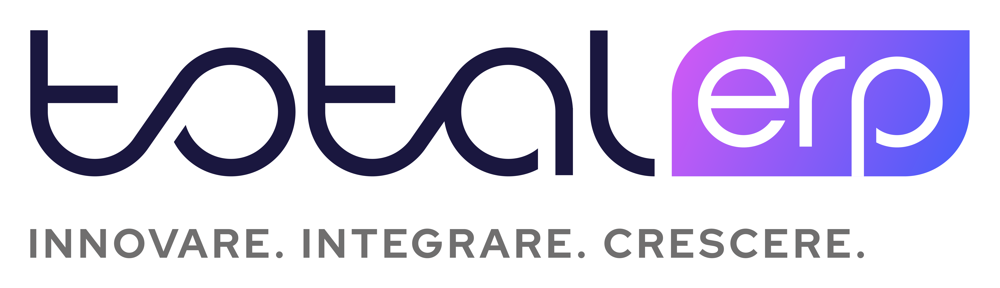

  <!-- Sostituisci il file qui sotto con il tuo logo -->
  

> **Gestionali ERP, Hardware, Software e Web** per aziende che vogliono semplificare i processi, integrare i dati e lavorare meglio, ogni giorno.

---

## 🧭 Indice
- [📌 Chi siamo](#-chi-siamo)
- [🛠️ Cosa facciamo](#️-cosa-facciamo)
- [🚀 Per iniziare](#-per-iniziare)
- [🤝 Assistenza](#-assistenza)
- [📍 Dati legali & sedi](#-dati-legali--sedi)
- [📂 Struttura consigliata delle repository](#-struttura-consigliata-delle-repository)
- [🧑‍💻 Linee guida di collaborazione](#-linee-guida-di-collaborazione)
- [🔐 Sicurezza & privacy](#-sicurezza--privacy)
- [📞 Contatti rapidi](#-contatti-rapidi)

---

## 📌 Chi siamo
**totalErp** è un team specializzato nell’implementazione di **gestionali ERP** e soluzioni **IT end‑to‑end**: dall’infrastruttura hardware al software verticale, fino ai servizi web integrati.  
Puntiamo su **chiarezza, automazione e integrazione** per portare efficienza misurabile nei processi aziendali.

Sito web: **https://totalErp.it**

**Referente**: *Gherardo Poni*

---

## 🛠️ Cosa facciamo
- **ERP & Processi**: analisi, personalizzazioni, migrazioni, reportistica, integrazioni con sistemi esterni.
- **Hardware**: server, networking, backup, continuità operativa, monitoraggio.
- **Software**: sviluppo su misura, API, integrazioni con DB/ERP, automazioni.
- **Web**: siti e portali, aree riservate, e‑commerce, connettori e servizi cloud.
- **Formazione**: onboarding utenti, manuali operativi e affiancamento in produzione.

> Obiettivo: **ridurre i tempi**, **aumentare l’affidabilità** e **dare visibilità ai dati** che contano.

---

## 🚀 Per iniziare
1. **Scrivici** i processi critici (fatturazione, magazzino, produzione, assistenza, ecc.).  
2. **Definiamo insieme** gli obiettivi (KPI, tempi, responsabilità).  
3. **Progettiamo** una roadmap breve (MVP) e iteriamo con rilasci frequenti.  

Se stai aprendo una nuova repository cliente, vedi la sezione seguente per la **struttura consigliata**.

---

## 🤝 Assistenza
- Email: **assistenza@totalerp.it**
- Canali: email
- Telefono: 0364 1916054

---

## 📍 Dati legali & sedi
- **Ragione sociale**: *totalErp*
- **P. IVA**: **04335950988**
- **Sede legale**: *Via Primo Maggio, 4 — 25055 Pisogne (BS)*
- **Sede operativa**: *Via Fausto Cadeo, 34 — 25047 Darfo Boario Terme (BS)*

---

## 📞 Contatti rapidi
- 🌐 **Sito**: https://totalErp.it
- 📧 **Assistenza**: assistenza@totalerp.it
- 👤 **Referente**: Gherardo Poni
- 📍 **Sede legale**: Via Primo Maggio, 4 — 25055 Pisogne (BS)
- 🏢 **Sede operativa**: Via Fausto Cadeo, 34 — 25047 Darfo Boario Terme (BS)

---

  © 2026 totalErp — Tutti i diritti riservati

